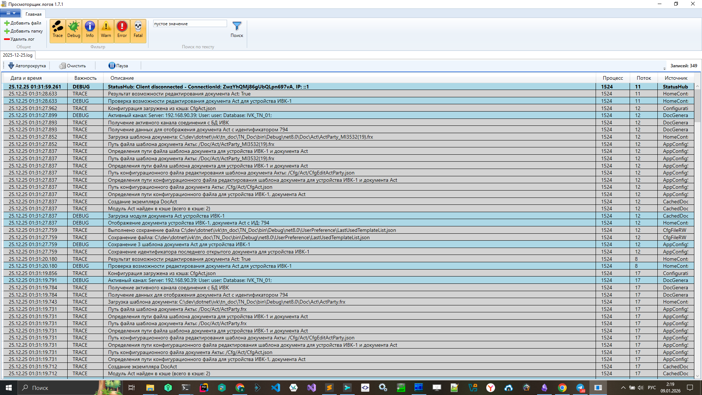

# 🏗️ Архитектура

## 📋 Содержание

- [Обзор](#-обзор)
- [Clean Architecture](#-clean-architecture)
- [Слои приложения](#-слои-приложения)
- [Диаграммы](#-диаграммы)
- [Структура проекта](#-структура-проекта)
- [Потоки данных](#-потоки-данных)
- [UI референс](#-ui-референс)

---

## 📖 Обзор

NLogMonitor построен на принципах **Clean Architecture**, обеспечивая:

- Независимость от фреймворков
- Тестируемость бизнес-логики
- Независимость от UI и базы данных
- Простоту замены внешних компонентов

---

## 🎯 Clean Architecture

```
┌─────────────────────────────────────────────────────────────┐
│                     Presentation Layer                       │
│                  (API Controllers, Vue 3 UI)                 │
├─────────────────────────────────────────────────────────────┤
│                     Application Layer                        │
│               (Services, DTOs, Interfaces)                   │
├─────────────────────────────────────────────────────────────┤
│                      Domain Layer                            │
│              (Entities, Enums, Value Objects)                │
├─────────────────────────────────────────────────────────────┤
│                   Infrastructure Layer                       │
│            (Parser, Storage, Export, External)               │
└─────────────────────────────────────────────────────────────┘
```

**Правило зависимостей**: Внутренние слои не знают о внешних.

---

## 📚 Слои приложения

### Domain Layer

Ядро системы. Не имеет зависимостей.

```csharp
// Entities
public class LogEntry
{
    public int Id { get; set; }
    public DateTime Timestamp { get; set; }
    public LogLevel Level { get; set; }
    public required string Message { get; set; }
    public required string Logger { get; set; }
    public int? ProcessId { get; set; }
    public int? ThreadId { get; set; }
    public string? Exception { get; set; }
}

public class LogSession
{
    public Guid Id { get; set; }
    public required string FileName { get; set; }
    public required string FilePath { get; set; }
    public long FileSize { get; set; }
    public DateTime CreatedAt { get; set; }
    public DateTime ExpiresAt { get; set; }
    public List<LogEntry> Entries { get; set; } = [];
    public Dictionary<LogLevel, int> LevelCounts { get; set; } = [];
}

public class RecentLogEntry
{
    public required string Path { get; set; }
    public bool IsDirectory { get; set; }
    public DateTime OpenedAt { get; set; }
}

// Enums
public enum LogLevel
{
    Trace = 0,
    Debug = 1,
    Info = 2,
    Warn = 3,
    Error = 4,
    Fatal = 5
}
```

### Application Layer

Бизнес-логика и интерфейсы.

```csharp
// Interfaces
public interface ILogParser
{
    IAsyncEnumerable<LogEntry> ParseAsync(Stream stream, CancellationToken ct = default);
    bool CanParse(string fileName);
}

public interface ISessionStorage
{
    Task<Guid> SaveAsync(LogSession session, CancellationToken ct = default);
    Task<LogSession?> GetAsync(Guid sessionId, CancellationToken ct = default);
    Task DeleteAsync(Guid sessionId, CancellationToken ct = default);
}

public interface ILogService
{
    Task<OpenFileResultDto> OpenFileAsync(string filePath, CancellationToken ct = default);
    Task<PagedResultDto<LogEntryDto>> GetLogsAsync(Guid sessionId, FilterOptionsDto filter, int page, int pageSize, CancellationToken ct = default);
}

public interface IFileWatcherService
{
    void StartWatching(Guid sessionId, string filePath);
    void StopWatching(Guid sessionId);
}

public interface ILogExporter
{
    Task<byte[]> ExportAsync(IEnumerable<LogEntry> entries, string format, CancellationToken ct = default);
}

public interface IRecentLogsRepository
{
    Task<IReadOnlyList<RecentLogEntry>> GetAllAsync(CancellationToken ct = default);
    Task AddAsync(RecentLogEntry entry, CancellationToken ct = default);
}

// DTOs
public record FilterOptionsDto(
    string? SearchText,
    LogLevel? MinLevel,
    LogLevel? MaxLevel,
    DateTime? FromDate,
    DateTime? ToDate,
    string? Logger
);

public record PagedResultDto<T>(
    IReadOnlyList<T> Items,
    int TotalCount,
    int Page,
    int PageSize,
    int TotalPages
);

public record OpenFileResultDto(
    Guid SessionId,
    string FileName,
    string FilePath,
    int TotalEntries,
    Dictionary<LogLevel, int> LevelCounts
);
```

### Infrastructure Layer

Реализации интерфейсов.

| Компонент | Назначение |
|-----------|-----------|
| `NLogParser` | Regex-парсинг логов NLog |
| `InMemorySessionStorage` | Хранение в памяти с TTL |
| `JsonExporter` | Экспорт в JSON |
| `CsvExporter` | Экспорт в CSV |
| `FileWatcherService` | Мониторинг изменений файлов |
| `RecentLogsFileRepository` | Хранение истории в JSON |

### Presentation Layer

API контроллеры и Vue 3 UI.

---

## 📊 Диаграммы

### Компонентная диаграмма

```
┌──────────────────────────────────────────────────────────────────┐
│                     Client (Browser / WebView)                     │
│  ┌────────────┐  ┌──────────┐  ┌──────────┐  ┌────────────────┐  │
│  │FileSelector│  │ LogTable │  │ Filters  │  │ ExportButton   │  │
│  └─────┬──────┘  └────┬─────┘  └────┬─────┘  └───────┬────────┘  │
│        │              │             │                 │           │
│        └──────────────┼─────────────┼─────────────────┘           │
│                       │  Pinia Stores                             │
└───────────────────────┼───────────────────────────────────────────┘
                      │ HTTP (REST API)
┌─────────────────────┼─────────────────────────────────────────────┐
│                     ▼                                             │
│  ┌──────────────────────────────────────────────────────────────┐│
│  │                    ASP.NET Core Web API                       ││
│  │  ┌────────────┐  ┌────────────┐  ┌────────────────────────┐  ││
│  │  │UploadCtrl  │  │ LogsCtrl   │  │ ExportCtrl             │  ││
│  │  └─────┬──────┘  └─────┬──────┘  └───────────┬────────────┘  ││
│  │        │               │                      │               ││
│  │        └───────────────┼──────────────────────┘               ││
│  │                        ▼                                      ││
│  │  ┌──────────────────────────────────────────────────────────┐││
│  │  │                    LogService                             │││
│  │  └──────────────────────┬───────────────────────────────────┘││
│  │                         │                                     ││
│  │    ┌────────────────────┼────────────────────┐               ││
│  │    ▼                    ▼                    ▼               ││
│  │ ┌──────────┐    ┌──────────────┐    ┌──────────────┐        ││
│  │ │NLogParser│    │SessionStorage│    │ExportService │        ││
│  │ └──────────┘    └──────────────┘    └──────────────┘        ││
│  └──────────────────────────────────────────────────────────────┘│
└───────────────────────────────────────────────────────────────────┘
```

### Sequence диаграмма: Загрузка файла

```
User        FileSelector      API            LogService        NLogParser       Storage
 │               │              │                  │                │              │
 │  Select file  │              │                  │                │              │
 │──────────────>│              │                  │                │              │
 │               │POST /upload  │                  │                │              │
 │               │─────────────>│                  │                │              │
 │               │              │ OpenFileAsync()  │                │              │
 │               │              │─────────────────>│                │              │
 │               │              │                  │ ParseAsync()   │              │
 │               │              │                  │───────────────>│              │
 │               │              │                  │                │──┐           │
 │               │              │                  │                │  │ Streaming │
 │               │              │                  │                │<─┘ Parse     │
 │               │              │                  │<───────────────│              │
 │               │              │                  │ SaveAsync()    │              │
 │               │              │                  │────────────────────────────────>│
 │               │              │                  │<────────────────────────────────│
 │               │              │<─────────────────│                │              │
 │               │ { sessionId }│                  │                │              │
 │               │<─────────────│                  │                │              │
 │  Show table   │              │                  │                │              │
 │<──────────────│              │                  │                │              │
```

---

## 📁 Структура проекта

```
NLogMonitor/
├── src/
│   ├── NLogMonitor.Domain/           # Domain Layer (Entities, Enums)
│   │   ├── Entities/
│   │   │   ├── LogEntry.cs
│   │   │   ├── LogSession.cs
│   │   │   ├── LogLevel.cs
│   │   │   └── RecentLogEntry.cs
│   │   └── NLogMonitor.Domain.csproj
│   │
│   ├── NLogMonitor.Application/      # Application Layer
│   │   ├── Interfaces/
│   │   │   ├── ILogParser.cs
│   │   │   ├── ISessionStorage.cs
│   │   │   ├── ILogService.cs
│   │   │   ├── IFileWatcherService.cs
│   │   │   ├── ILogExporter.cs
│   │   │   └── IRecentLogsRepository.cs
│   │   ├── DTOs/
│   │   │   ├── LogEntryDto.cs
│   │   │   ├── FilterOptionsDto.cs
│   │   │   ├── PagedResultDto.cs
│   │   │   ├── OpenFileResultDto.cs
│   │   │   ├── RecentLogDto.cs
│   │   │   └── ClientLogDto.cs
│   │   └── NLogMonitor.Application.csproj
│   │
│   ├── NLogMonitor.Infrastructure/   # Infrastructure Layer
│   │   ├── Parsing/
│   │   │   └── NLogParser.cs
│   │   ├── Storage/
│   │   │   ├── InMemorySessionStorage.cs
│   │   │   └── RecentLogsFileRepository.cs
│   │   ├── FileSystem/
│   │   │   └── FileWatcherService.cs
│   │   ├── Export/
│   │   │   ├── JsonExporter.cs
│   │   │   └── CsvExporter.cs
│   │   └── NLogMonitor.Infrastructure.csproj
│   │
│   ├── NLogMonitor.Api/              # Presentation Layer (Web API)
│   │   ├── Controllers/
│   │   │   ├── LogsController.cs
│   │   │   ├── FilesController.cs
│   │   │   ├── UploadController.cs
│   │   │   ├── ExportController.cs
│   │   │   ├── RecentController.cs
│   │   │   └── ClientLogsController.cs
│   │   ├── Hubs/
│   │   │   └── LogWatcherHub.cs
│   │   ├── Program.cs
│   │   ├── appsettings.json
│   │   ├── nlog.config
│   │   └── NLogMonitor.Api.csproj
│   │
│   └── NLogMonitor.Desktop/          # Photino Desktop Shell
│       ├── Program.cs
│       ├── Services/
│       │   └── NativeDialogService.cs
│       └── NLogMonitor.Desktop.csproj
│
├── client/                           # Vue 3 Frontend
│   ├── src/
│   │   ├── components/
│   │   │   ├── ui/                   # shadcn-vue components
│   │   │   ├── LogTable/
│   │   │   ├── FilterPanel/
│   │   │   ├── SearchBar/
│   │   │   ├── FileSelector/
│   │   │   └── ExportButton/
│   │   ├── stores/
│   │   │   ├── logStore.ts
│   │   │   ├── filterStore.ts
│   │   │   └── recentStore.ts
│   │   ├── api/
│   │   │   ├── client.ts
│   │   │   └── signalr.ts
│   │   ├── composables/
│   │   │   ├── useLogs.ts
│   │   │   ├── useFileWatcher.ts
│   │   │   └── usePhotinoBridge.ts
│   │   ├── types/
│   │   │   └── index.ts
│   │   ├── App.vue
│   │   └── main.ts
│   ├── package.json
│   └── vite.config.ts
│
├── tests/
│   ├── NLogMonitor.Domain.Tests/
│   ├── NLogMonitor.Application.Tests/
│   ├── NLogMonitor.Infrastructure.Tests/
│   └── NLogMonitor.Api.Tests/
│
├── docs/
├── docker-compose.yml
├── NLogMonitor.sln
├── PLAN.md
├── CLAUDE.md
└── README.md
```

---

## 🔄 Потоки данных

### 1. Загрузка и парсинг

```
File → Stream → NLogParser → IAsyncEnumerable<LogEntry> → LogSession → Storage
```

### 2. Фильтрация и отображение

```
UI Filters → LogFilterDto → LogService.GetLogsAsync() → PagedResult<LogEntry> → UI Table
```

### 3. Экспорт

```
Export Request → LogService → ExportService → byte[] (JSON/CSV) → File Download
```

---

## 🔗 Связанные документы

- [API Reference](API.md)
- [Development Guide](DEVELOPMENT.md)
- [Configuration](CONFIGURATION.md)

---

## 🎨 UI референс

За основу дизайна взят интерфейс nLogViewer (WPF-приложение):



### Ключевые элементы интерфейса

| Элемент | Описание |
|---------|----------|
| **Toolbar** | Кнопки "Добавить файл", "Добавить папку", "Удалить лог" |
| **Фильтр по уровням** | Визуальные кнопки-иконки: Trace, Debug, Info, Warn, Error, Fatal |
| **Поиск** | Текстовое поле с кнопкой фильтрации |
| **Вкладки файлов** | Табы с именами открытых лог-файлов |
| **Панель управления** | Автопрокрутка, Очистить, Пауза, счётчик записей |
| **Таблица логов** | Колонки: Дата/время, Уровень, Описание, Процесс, Поток, Источник |

### Цветовая схема уровней логирования

| Уровень | Цвет фона |
|---------|-----------|
| TRACE | Светло-голубой |
| DEBUG | Жёлтый |
| INFO | Белый/нейтральный |
| WARN | Оранжевый |
| ERROR | Красный |
| FATAL | Тёмно-красный |

### Улучшения для NLogMonitor

Современный веб-интерфейс должен включать:

- Тёмная тема (Dark mode)
- Responsive дизайн для разных экранов
- Виртуальный скроллинг для миллионов записей
- Расширенные фильтры с автодополнением
- Горячие клавиши для быстрой навигации
- Real-time обновления через SignalR
